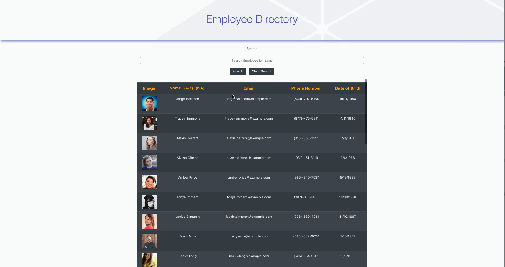

# Employee Directory

In this project, I've created an employee directory application using React. I've broken the application down into components, managed the state of the components and respond to the user's events. In this application, I've utilized an API with random employee information and utilized an axios call to grab the results I wanted to display on my employee table. In this application, the user can use the search field to find and filter employees by name or could also click on the name header to sort the employees in ascending or descending order by first name. I've added additional features to it wherein the email of each employee has a hyperlink that will open up the mail application so that you could quickly contact the employee and the same with the phone number, it is a hyperlink that will allow users to call the employee directly. The way I have designed this application is simple and elegant colors and I've set the table to be responsive in such a way that the list of employees won't be a long and overwhelming list on the page but it has a scrollbar within the table. Another feature in this application is that with every letter typed in the search field, this will begin filtering the results of employees.

I am still adjusting on how to use React. I'm a new coder and still learning to become a coding master which I hope won't be too far away to achieve. This was especially a challenging project for me since I am not used to the way to manage component states. While making this application, I've slowly but not fully come to understand how things work. I definitely want to practice more on this and get used to the structure. I have been struggling on this topic but I've had small wins in writing out the code. I utilized global state with react hooks and context to accomplish this project. Again, it wasn't easy since the day I've learned about global state was the same day I decided to go in this direction and I've ran into error after error but was able to get things up and running little by little. I'm happy with the outcome as it is fairly decent for a day's worth of coding this project out. Along the way, I'm sure I will update as I try to understand React more and more. I do like the way things are set up with React but it can be tedious and it is a huge adjustment from what I know and understand using HTML, jQuery, Vanilla JavaScript, etc. 

## Table of Contents

* [Technologies Used](#technologies-used)
* [GIF of Project](#gif-of-project)
* [Code Snippets](#code-snippets)
* [Deployed Link](#deployed-link)
* [Author](#author)
* [License](#license)
* [Acknowledgments](#acknowledgments)

## Technologies Used

* [React.js](https://reactjs.org/)
* [Javascript](https://developer.mozilla.org/en-US/docs/Web/JavaScript)
* [HTML](https://developer.mozilla.org/en-US/docs/Web/HTML)
* [CSS](https://developer.mozilla.org/en-US/docs/Web/CSS)

## GIF of Project

Here's a GIF of the application.




## Code Snippets

Here's a code snippet of the initialState variable of empty arrays for the employees and the selected employees.

```
const initialState = {
    employees: [],
    selectedEmployees: []
  };
```
In this next code snippet, I have a reducer and this is one of the action types I am executing if it's called upon to dispatch to change the initial state and as explained in the code below this action type is filtering the employees and searching them by name.

```
export const reducer = (state, action) => {
    switch (action.type) {
        case SEARCH_EMPLOYEES:
            // if the input field is an empty string, return to the initial state else, filter employee results
            if(action.payload === "") {
                return {
                    ...state,
                    selectedEmployees: 
                        state.employees}
            } else if(action.payload !== "") {
                return {
                    ...state,
                    selectedEmployees: 
                        state.employees.filter(employee => {
                        const name = employee.firstname + " " + employee.lastname;
                        return name.toLowerCase().includes(action.payload.toLowerCase());
                    })
                };
            };
            break;
    }
```

In this next code snippet, this is the search function and where I import our dispatch so that I could execute the action type for searching employees by name. I've also imported useState and useEffect from react so that I could execute the onChange of the search input.
```
function Search() {
    // variable for dispatch to grab and execute specific actions
    const { dispatch } = useContext(EmployeeContext);
    // variable for the state of our search value
    const [search, setSearch] = useState('');

    // allows to see filtered results with every letter change in the search input
    useEffect(() => {
            dispatch({type: SEARCH_EMPLOYEES, payload: search});
    }, [search]);

    // search employees function, the dispatch we call to filter the results
    function searchEmployees(e)  {
        e.preventDefault();
        dispatch({type: SEARCH_EMPLOYEES, payload: search});
        setSearch(search);
    };

  return (
    <div className="container">
        <form>
            <div className="form-group text-center">
                <label for="formGroupExampleInput">Search</label>
                <input 
                    type="text" 
                    value={search} 
                    onChange={e => setSearch(e.target.value)} 
                    className="form-control" 
                    id="searchInput" 
                    placeholder="Search Employee by Name"
                />
                <button 
                    className="btn btn-dark mr-2 mt-3" 
                    onClick={searchEmployees}>
                        Search
                </button>
            </div>
        </form>
    </div>
    );
};

export default Search;
```

## Deployed Link
- [See Live Site]()

## Author

* Janessa Reeanne Fong

- [Link to Github](https://github.com/janessaref)
- [Link to LinkedIn](https://www.linkedin.com/in/janessafong)
- [Link to Portfolio](https://janessarefong.herokuapp.com/)

## License

This project is licensed under the MIT License 

## Acknowledgments

* I'd like to acknowledge my tutor Andrew Knapp for helping me on this project.
* To my mentors and instructors, Jerome Chenette, Mahisha Gunasekaran, and Manuel Nunes for helping and teaching me throughout this program.
